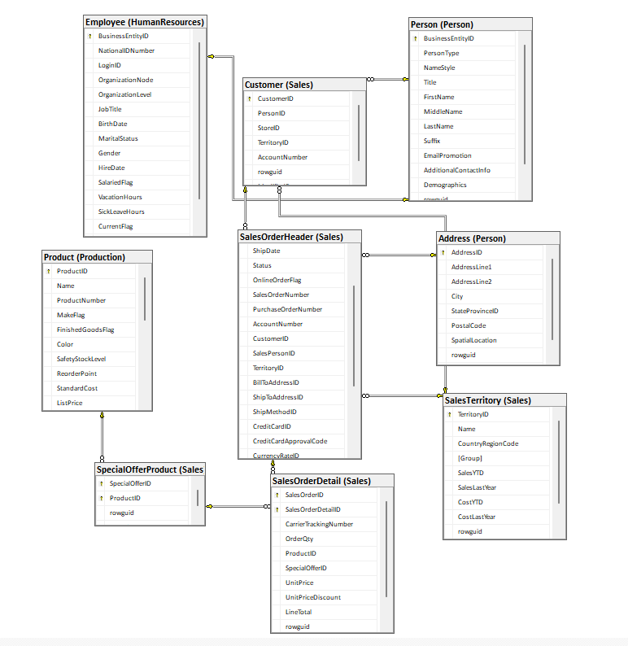
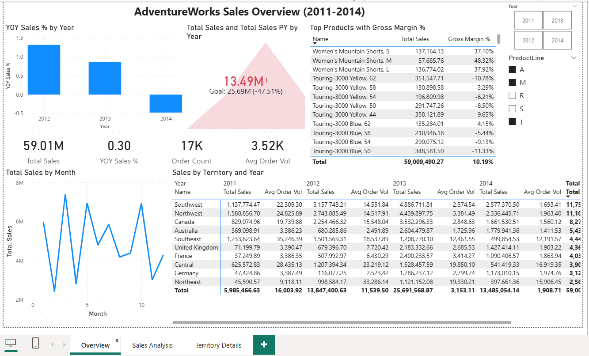
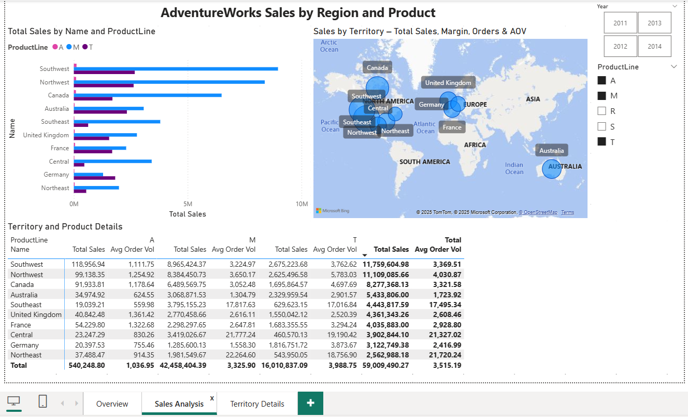
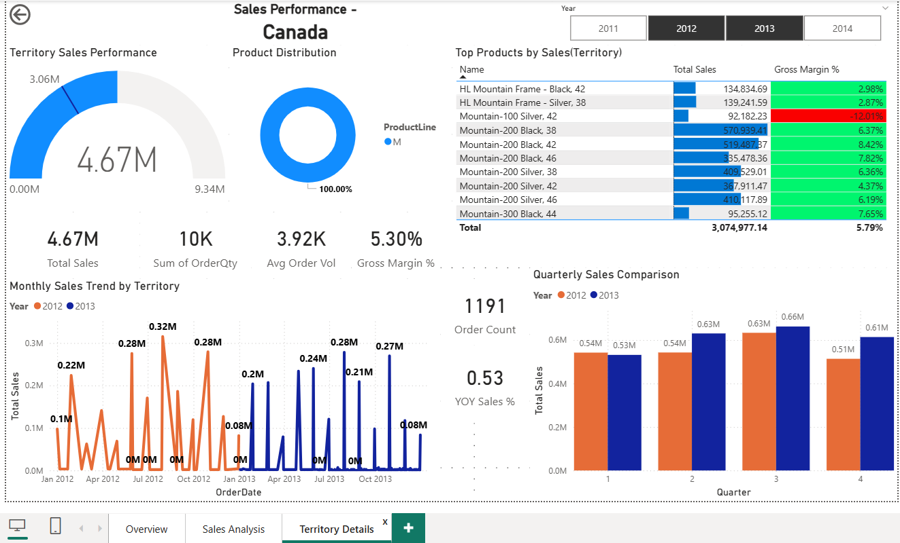

# AdventureWorks Sales Dashboard (2011–2014)

## Dataset and Model
- Source: AdventureWorks OLTP (June 2011– June 2014) sales orders.
- Tables: FactSalesDetail at order-line grain, DimDate, DimProduct, DimCustomer, DimTerritory, SalesHeader.
- Tools: SQL Server, Power Query, Power BI Desktop, DAX measures, Drillthrough navigation.

### Data Model (Star Schema)

## Page 1 – Sales Overview
**Purpose:** Revenue, order volume, and AOV trends across 2011–2014.

### Page 1 – Sales Overview
 

**Key findings**
- Sales grow strongly from 2011 and peak in 2013, then drop sharply in 2014, which is only a partial year; as a result both Total Sales and YOY Sales % are much lower than 2013.
- From 2011–2014 the business generates roughly ~$110M in revenue from about 31K orders, with an average order value of around ~$3.5K; the 2014 decline is driven by both fewer orders and smaller orders compared to 2013.
- Monthly sales vary through the year with a clear peak around March, indicating an early-year demand spike followed by weaker months later in the year.
- High-priced bikes (e.g., Mountain-200) dominate Total Sales, while accessories like Fender Set – Mountain lead in Gross Margin %, generating about 62% profit per dollar of revenue.
- Southwest and a few other regions lead in Total Sales, and Average Order Value varies by region, suggesting regional differences in product mix and typical order size.

## Page 2 – Region and Product Details
**Purpose:** Break down sales and average order value by territory and product line to show where revenue and basket size are strongest.

### Page 2 – Sales Analysis

**Key findings**
- Southwest and Northwest are the largest territories by Total Sales, with several other regions (e.g., Canada, Central) forming a strong second tier.
- Mountain (M) product lines dominate revenue across most territories, while Road (R) and Touring (T) products still contribute meaningful share in specific regions.
- Average Order Value varies significantly by territory: some regions generate fewer orders but much higher AOV, indicating fewer but larger, higher-value baskets in terms of revenue per order.
- Combining the bar chart and matrix highlights territories where high-margin product lines (like accessories) are under-penetrated, suggesting clear cross-sell and upsell opportunities.

## Page 3 – Territory Details (Drillthrough)
**Purpose:** Deep dive into single territory performance with 2012-2013 focus.

### Page 3 – Territory Details (Drillthrough)

**Key visuals & insights:**
- **Gauge**: 2013 sales vs 2012 target (territory-specific performance)
- **Monthly trend**: 2012 (blue) vs 2013 (orange) line chart showing seasonal patterns
- **6 KPI cards**: Total Sales, Order Quantity, Avg Order Vol, Gross Margin %, Order Count, YoY Sales %
- **Top Products table**: Conditional formatting (green high-margin, red low-margin)
- **Product donut**: Top 3 product lines by sales distribution
- **Quarterly columns**: 2012 (blue) vs 2013 (orange) comparison

**Navigation**: Drill from Sales Analysis to Territory Details visuals to this page.

**Core measures**
- **Total Sales** – sum of LineTotal (quantity × unit price) from the detail table.
- **YOY Sales & YOY Sales %** – current vs. prior‑year sales using SAMEPERIODLASTYEAR with a blank check for missing prior periods.
- **Total Cost, Gross Margin & Gross Margin %** – standard‑cost‑based profitability measures.
- **Order Count** – distinct SalesOrderID (number of orders).
- **Average Order Value (AOV)** – Total Sales ÷ Order Count (average revenue per order).

## Files
- [AdventureWorks_Sales.pbix](03-PowerBI/AdventureWorks_Sales.pbix)

## Implementation Notes
- Star schema with automatic drillthrough filtering
- Wrote T-SQL queries in SQL Server to extract sales header/detail, product, customer, and territory data from AdventureWorks OLTP (2011–2014).
- Cleaned and modeled the data in Power Query, building a star schema with FactSalesDetail at order-line grain and DimDate, DimProduct, DimCustomer, DimTerritory, plus a SalesHeader helper table.
- Created DAX measures for Total Sales, YOY Sales/%, Total Cost, Gross Margin/%, Order Count, and Average Order Value, then used them to design the report pages.
- 2012-2013 focus on Territory Details excludes partial 2011/2014 years.

## SQL Layer

## SQL Queries and Supported Visuals
- [SQL queries](01-SQL-Queries/)
- [SQL outputs](02-SQL-Outputs/)

1. **01_yoy_sales_by_year.sql**  
   - **Page:** Sales Overview  
   - **Supports:**  
     - "YOY Sales % by Year" column chart  
     - YOY KPI cards (Total Sales, Total Sales PY, YOY Sales %)

2. **02_total_sales_by_month_2011_2014.sql**  
   - **Page:** Sales Overview  
   - **Supports:**  
     - "Total Sales by Month" line chart  
     - Seasonal pattern used in narrative

3. **03_sales_by_territory_and_rank.sql**  
   - **Page:** Sales Analysis  
   - **Supports:**  
     - "Sales by Territory" bar chart  
     - Territory map (bubble size by Total Sales)  
     - Insight that Southwest/Northwest are top territories

4. **04_product_margin_by_territory_topN.sql**  
   - **Page:** Territory Details  
   - **Supports:**  
     - "Top Products by Sales (Territory)" table with Gross Margin % conditional formatting  
     - Margin-focused commentary (high vs low margin products)

5. **05_top_products_by_sales_per_territory.sql**  
   - **Page:** Territory Details  
   - **Supports:**  
     - Revenue ranking in "Top Products by Sales (Territory)"  
     - Cross-check of DAX Top N products logic

6. **06_quarterly_sales_2012_2013_by_territory.sql**  
   - **Page:** Territory Details  
   - **Supports:**  
     - "Quarterly Sales Comparison" clustered column chart (2012 vs 2013)  
     - 2012–2013 territory performance story

