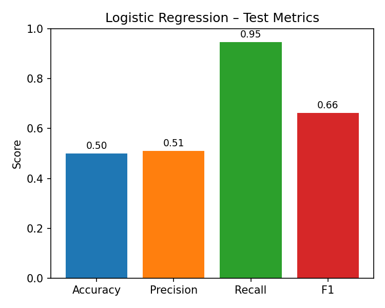
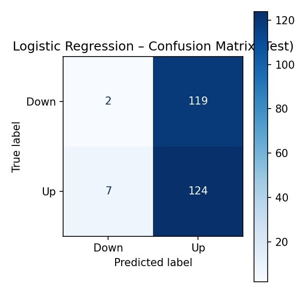

# StocksClassification – 5‑year stock direction classification (AAPL, AMZN, MSFT, VOO, SPY)

Analyze 5 years of daily OHLCV data for AAPL, AMZN, MSFT, VOO, and SPY and build a simple classification model to predict whether the next‑day return is positive (up) or not (down).

## Why this matters for a data analyst role

This project demonstrates an end‑to‑end analytical workflow on financial time‑series data: defining a business‑style question, sourcing and cleaning market data, engineering features, training and evaluating a classification model, and communicating results and limitations to non‑technical stakeholders.[file:53]

---

## Project structure

```text
stock-classification-5y-aapl-amzn-msft-voo-spy/
├── data/
│   ├── raw/         # Direct pulls from Yahoo Finance (one file per ticker)
│   └── processed/   # Cleaned & model-ready tables (clean_prices.csv, model_data.csv)
├── notebooks/
│   ├── 01_data_acquisition.ipynb
│   ├── 02_cleaning_eda.ipynb
│   ├── 03_feature_engineering.ipynb
│   └── 04_modeling_evaluation.ipynb
├── src/
│   ├── config.py
│   ├── data_acquisition.py│   
└── reports/
    ├── figures/    

```

## Exploratory Data Analysis (EDA)

I performed basic EDA on 5 years of daily OHLCV data for AAPL, AMZN, MSFT, VOO, and SPY. The analysis used adjusted close prices to derive daily simple returns (ret_*) and log returns (logret_*), then examined trends, risk, and co‑movement across tickers.

## EDA highlights

Trend and levels: All five tickers show a generally upward price trend over the 5‑year window, with AAPL, AMZN, and MSFT reaching higher peaks than the index ETFs VOO and SPY during bull phases.

Risk/volatility differences: Single stocks (especially AMZN) are visibly more volatile than VOO and SPY, reinforcing the idea that a diversified ETF is less risky than individual tech names.

Extreme moves and drawdowns: Individual stocks experience deeper single‑day losses and sharper drawdowns than the ETFs, highlighting heavier tail risk in single‑name exposure.

Correlations: Daily‑return correlations are strongly positive across all tickers, with VOO and SPY almost perfectly correlated and the tech stocks also highly correlated with the indexes, so they tend to move together in broad rallies or sell‑offs.

## Key EDA plots (saved to StocksClassification/reports/figures/):

price_history_adj_close.png – 5‑year adjusted close price history.

cumulative_returns_simple.png – cumulative simple returns by ticker.

returns_correlation_heatmap.png – correlation heatmap of daily returns.

Modeling and evaluation
The ML task is a binary classification of next‑day direction: up_next_day_TICKER = 1 if next‑day simple return > 0, else 0.

## In 04_modeling_evaluation.ipynb:

I built a time‑based train/test split, keeping the last ~1 year as a hold‑out period.

A naive baseline model that always predicts the majority class (“up”) achieves accuracy of about 0.52 on the test set.

A Logistic Regression model using the engineered features achieves test accuracy around 0.50, with precision ≈ 0.51, recall ≈ 0.95, and F1 ≈ 0.66 on the AAPL target.

A confusion matrix for the test set shows very few true negatives and many false positives (down days predicted as up), confirming that the model is aggressive in predicting “up” and often wrong on down days.







## Key findings
Over the last 5 years, the five tickers moved broadly together, with large drawdowns around major market stresses and persistent differences in volatility (single stocks more volatile than broad ETFs like VOO and SPY).

Daily direction (up vs. down tomorrow) is hard to predict: the Logistic Regression model’s test accuracy (~50%) is similar to a naive majority‑class baseline (~52%), indicating only a weak edge at the daily horizon.

The model is aggressive about calling “up” days: it achieves very high recall (~0.95) but modest precision (~0.51), and the confusion matrix shows many down days are still predicted as up, which limits its usefulness as a standalone trading signal.

Overall, the analysis is more valuable as a risk‑awareness and exploratory signal tool than as a production strategy: it highlights that short‑horizon stock moves are noisy, simple technical features have limited standalone power, and any real deployment should combine this with fundamentals, risk limits, and transaction‑cost considerations.

## How an analyst might use this
Use the EDA plots to quickly understand how AAPL, AMZN, MSFT, VOO, and SPY behaved over the last 5 years in terms of trend, drawdowns, volatility, and co‑movement.

Treat the classification model as a signal‑screening tool, not a trading system: it highlights days with a higher probability of an up move but should be combined with fundamental or macro views.

Leverage the confusion matrix and metric chart to tune risk stance: a high‑recall, low‑precision model may be acceptable for exploratory idea generation but is risky for sizing large positions.

Use this project as a template for other tickers or factors by swapping the target column (e.g., another up_next_day_*) and extending features, then comparing which assets show more predictable next‑day behavior.


## Limitations and next steps

- The models use only daily OHLCV‑derived technical features; adding macro, sentiment, or fundamental signals could improve predictability.
- Performance is evaluated on a single hold‑out window; repeating the experiment with rolling or walk‑forward splits would give a more robust view of generalization.
- Transaction costs, slippage, and position‑sizing rules are not modeled, so results should not be interpreted as backtested trading performance.
- The current implementation focuses on AAPL as the target; repeating the analysis for AMZN, MSFT, VOO, and SPY would show whether some tickers are more predictable than others.


## Tech stack

- Python (Pandas, NumPy, scikit‑learn)
- Jupyter Notebooks
- Matplotlib / Seaborn for visualization
- Yahoo Finance (or equivalent) as the market data source
